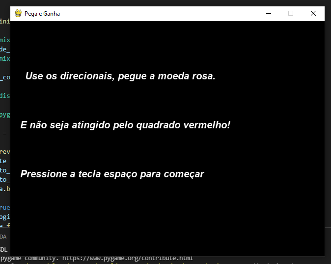
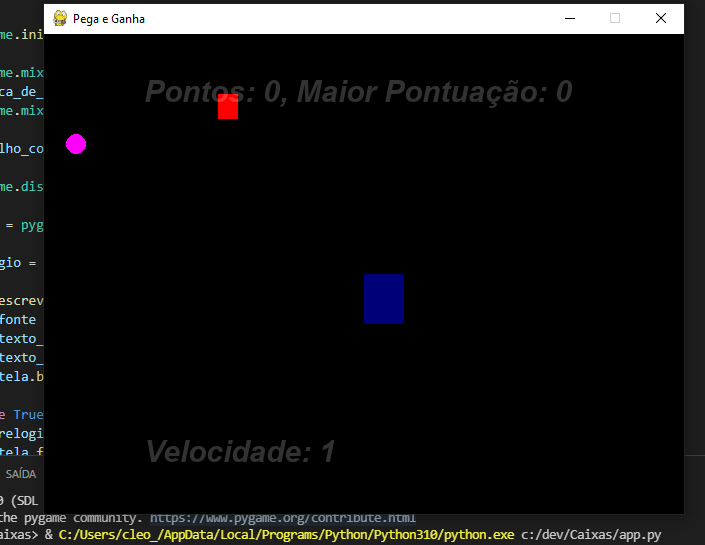
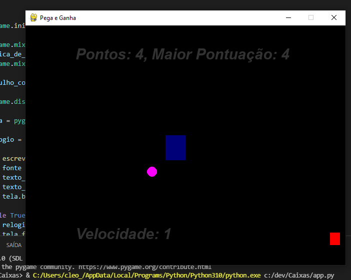
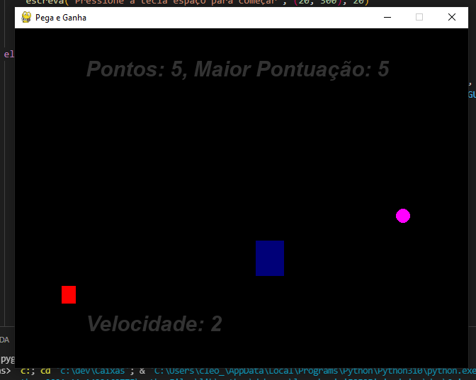
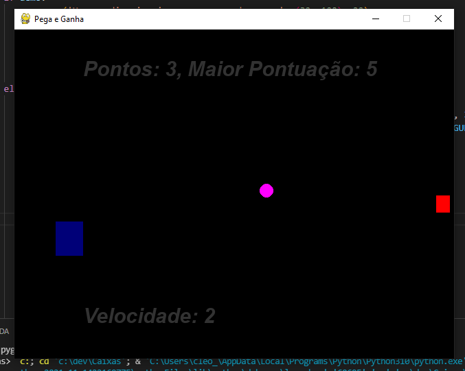
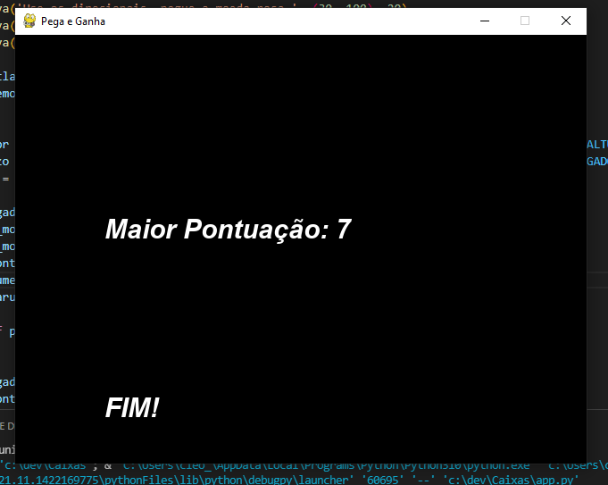

# Ganha e Perde

Projeto 2º Unidade Lógica de Programação 1º período Uniesp
**Referência:** Play list de João Tinti no [You Tube](https://www.youtube.com/watch?v=BT2cjrxGpWo&list=PLJ8PYFcmwFOxtJS4EZTGEPxMEo4YdbxdQ)

## Tela Inicial

> Neste momento o é apresentado ao jogador as regras do jogo com instruções simples e diretas.

## Comecando a jogar

> É exibido a tela com a pontuação atual, a pontuação máxima e a velocidade no status inicial do jogo. Também fica visível o jogador azul, a moeda rosa e o granizo vermelho.

## Pontuando

> Ao conseguir tocar a moeda a pontuação atual aumenta. A maior pontuação marca o máximo de pontos atingidos na partida.

## Aumentando o nivél de dificuldade

> A cada 5 pontos a velocidade do granizo aumenta. O valor é exebido na tela.
> A velocidade só aumenta se a pontuação, além de ser divisível por 5, seja maior que a pontuação máxima.

## Perdendo pontos

> Ao ser atigindo pelo granizo o jogador perde 1 ponto, porém a pontuação máxima continua marcando o máximo de pontos atigindos na partida.
> Vale ressaltar que a velocidade não diminui.

## Finalizando a partida

> A partida só acaba quando o jogador perde todos os pontos.
> Ao final é exibido a pontuação máxima atiginda na partida e a indicação do **fim**.

